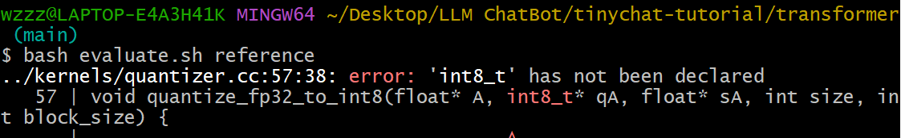
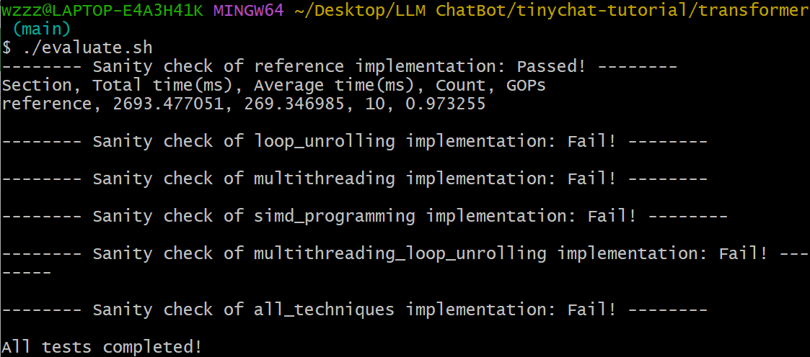
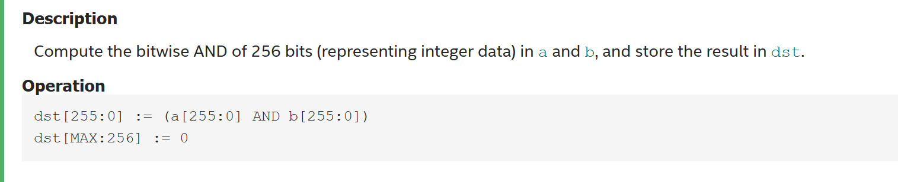

# Optimize LLM on Edge Devices

### Introduction

This is the **Lab 5** from Prof. Song Han's [**TinyML and Efficient Deep Learning Computing**](https://hanlab.mit.edu/courses/2024-fall-65940). The original instruction file can be found [here](https://drive.google.com/drive/folders/1MhMvxvLsyYrN-4C6eQG8Zj2JeSuyAOf0)

### Let's Get Started!

#### My System

- Operating system: Windows 11
- Processor: AMD (x86)
- Memory: 16GB

#### Set up

- Install [MSYS2](https://github.com/msys2/msys2-installer/releases/download/2024-01-13/msys2-x86_64-20240113.exe). Official Tutorial can be found [here](https://code.visualstudio.com/docs/cpp/config-mingw).
  - ​	If you get stuck in 50%, "updating trust database", try get disconnected from Internet.(Not sure what's the consequence lol).
- After installation, run MSYS2, use command line:

`pacman -S --needed base-devel mingw-w64-x86_64-toolchain make unzip git`

- go into file `transformer`, open windows power shell, input ` python download_model.py --model LLaMA_7B_2_chat --QM QM_x86`

#### Before Beginning

if you have the following error when running `./evaluate.sh` :



add`#include <stdint.h>` to file **kernel/quantizer.cc**

then run ` ./evaluate.sh reference` :



### Code

#### loop unrolling

##### Concept Introduction

- Loop reordering : rewrite mul to avoid frequent cache operation and optimize locality
- Loop tiling: we have limited cache size-> tailor each loop base on cache size
- loop unrolling: instruction cost: e.g.branch prediction

#### SIMD(Single Instruction Multiple Data)

[original document](https://www.intel.com/content/www/us/en/docs/intrinsics-guide/index.html#avxnewtechs=AVX2)

##### __m256i _mm256_and_si256 (__m256i a, __m256i b)



##### __m256i _mm256_srli_epi16 (__m256i a, int imm8)


##### __m256i _mm256_sub_epi8 (__m256i a, __m256i b)


#### Multithreading

use function `pthread_create()` and `pthread_join()`

**Tips: you can alter `thread_num` to suit your own processor**

#### Multithreading_loop_unrolling

Multithreading+loop_unrolling, similar solution.

#### All_techniques

combine all these techniques above.

### Result

For reference: 

```
-------- Sanity check of reference implementation: Passed! --------
Section, Total time(ms), Average time(ms), Count, GOPs
reference, 2773.055908, 277.304993, 10, 0.945325

-------- Sanity check of loop_unrolling implementation: Passed! --------
Section, Total time(ms), Average time(ms), Count, GOPs
loop_unrolling, 2109.656006, 210.964996, 10, 1.242591

-------- Sanity check of multithreading implementation: Passed! --------
Section, Total time(ms), Average time(ms), Count, GOPs
multithreading, 613.913025, 61.390999, 10, 4.270051

-------- Sanity check of simd_programming implementation: Passed! --------
Section, Total time(ms), Average time(ms), Count, GOPs
simd_programming, 1780.503052, 178.050003, 10, 1.472303

-------- Sanity check of multithreading_loop_unrolling implementation: Passed! --------
Section, Total time(ms), Average time(ms), Count, GOPs
multithreading_loop_unrolling, 466.839996, 46.683998, 10, 5.615286

-------- Sanity check of all_techniques implementation: Passed! --------
Section, Total time(ms), Average time(ms), Count, GOPs
all_techniques, 221.572006, 22.157000, 10, 11.831098

```

### Play with it

run `./evaluate.sh all_techniques` to get the best model , then run `./chat` .